# AI Support Ticket Analyst

**Ask questions about customer support tickets in plain English. Every answer is computed by SQL and statistics; the language model never does the arithmetic.**


**Current release: v1.0.0** (stable) - 18 September 2026. The HTTP API, the configuration settings and the `python run.py` startup are held stable under [Semantic Versioning](https://semver.org/); see [CHANGELOG.md](CHANGELOG.md) for what this release covers and how it got here.

---

## Table of Contents

1. [Overview](#overview)
2. [Documentation](#documentation)
3. [Screenshots](#screenshots)
4. [The Core Principle](#the-core-principle)
5. [Architecture](#architecture)
6. [Design Decisions](#design-decisions)
7. [Models and Tools](#models-and-tools)
8. [Getting Started](#getting-started)
9. [Configuration](#configuration)
10. [Using the System](#using-the-system)
11. [Example Queries and Outputs](#example-queries-and-outputs)
12. [Testing and Evaluation](#testing-and-evaluation)
13. [Known Limitations](#known-limitations)
14. [Future Improvements](#future-improvements)
15. [Project Structure](#project-structure)

---

## Overview

The system ingests a 500-row support ticket dataset, answers natural-language questions about it, and flags operational anomalies. It exposes all of this through a REST API and a web UI.

| Requirement (brief §2) | How it is met |
|---|---|
| Ingest the CSV and make it queryable | Loaded into SQLite at startup, with strict type coercion: missing values become SQL `NULL`, never `0` or `NaN` |
| Answer natural-language questions | An LLM translates the question into SQL, which runs on a read-only database; the LLM then phrases the real result |
| Detect and flag anomalies | Deterministic detectors (IQR outliers and SLA breaches) written in pandas, with no LLM involved |
| REST API **and** a minimal UI | FastAPI (4 endpoints plus interactive `/docs`) and a Streamlit UI that is a thin client of that API |
| Use an LLM, zero cost | Groq free tier, `openai/gpt-oss-120b` |
| Start with a single command | `python run.py` |

---

## Documentation

- **[Project Documentation](docs/PROJECT_DOCUMENTATION.md)** — the full write-up of the system's design and reasoning.
- **[System Card](docs/System_Card.pdf)** — capabilities, limitations and safety considerations of the deployed system.

---

## Screenshots

**The workspace.** System status in the sidebar - service, version, whether questions can be asked, how many tickets were loaded and from which file, and the date the data is anchored to - with suggested questions ready to try.

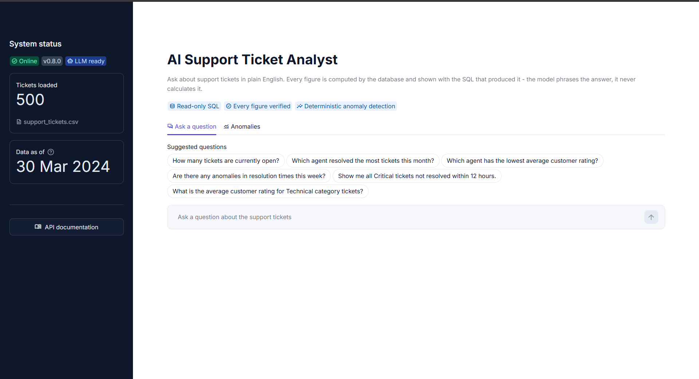

**A question, answered with its evidence.** The answer leads, followed by a one-line summary of how it was produced, the SQL that produced it, and the rows it returned - so every figure can be checked.

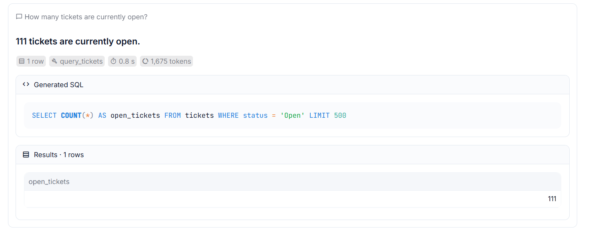

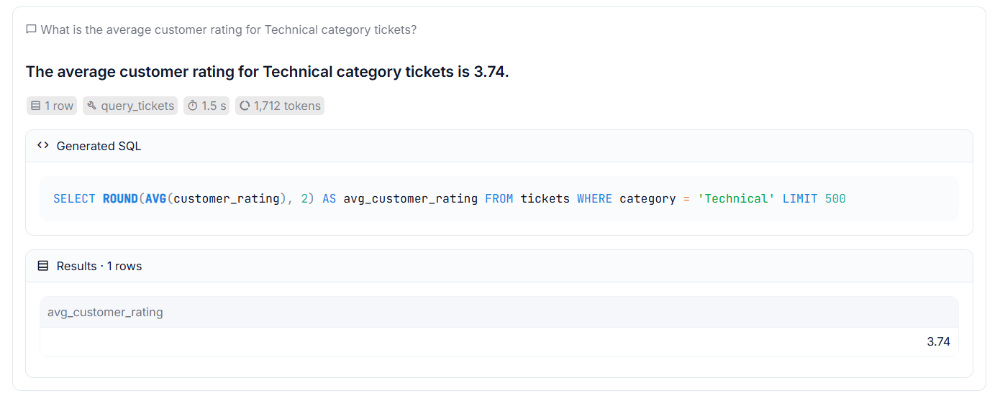

**A large result, summarised honestly.** 34 tickets matched and the model saw 20 of them, so the answer states the total before listing the sample. All 34 rows are shown below it, with a dash where a ticket has no resolution time.

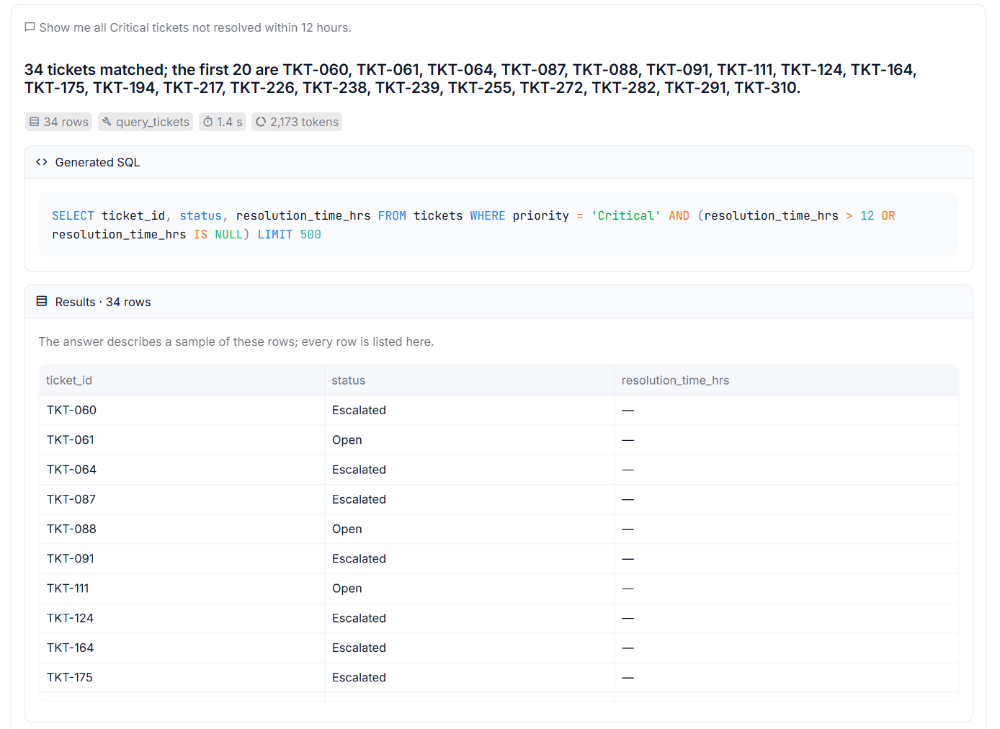

**Anomaly detection, with no language model involved.** A summary row gives the totals, and each detector has its own card with its threshold, a severity chart and the flagged tickets.

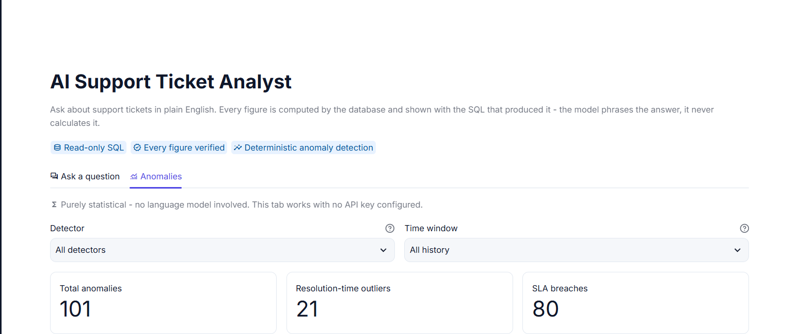

Resolution-time outliers: 21 of 327 resolved tickets are above the 48.15-hour threshold (Tukey fence, Q3 + 1.5 × IQR). The dashed line marks the threshold:

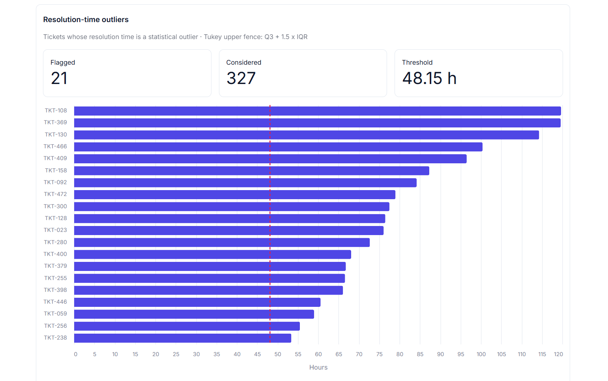

SLA breaches: all 80 unresolved High or Critical tickets are past the 24-hour window, the oldest by about 88 days (2,118.6 hours):

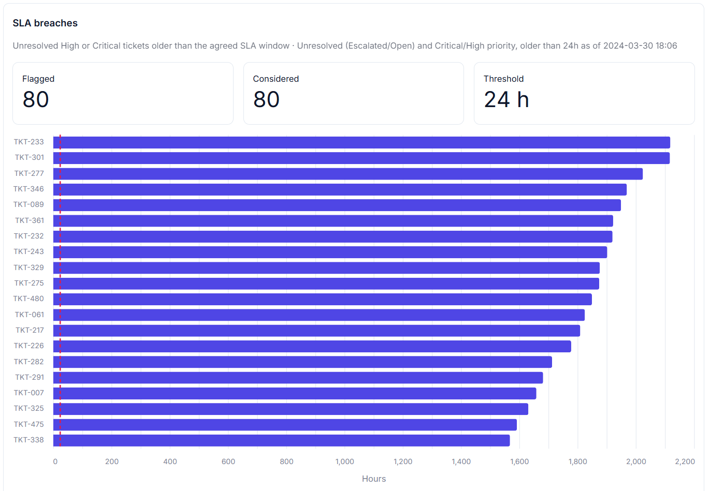

Every flagged ticket states its own reason, so no row needs explaining:

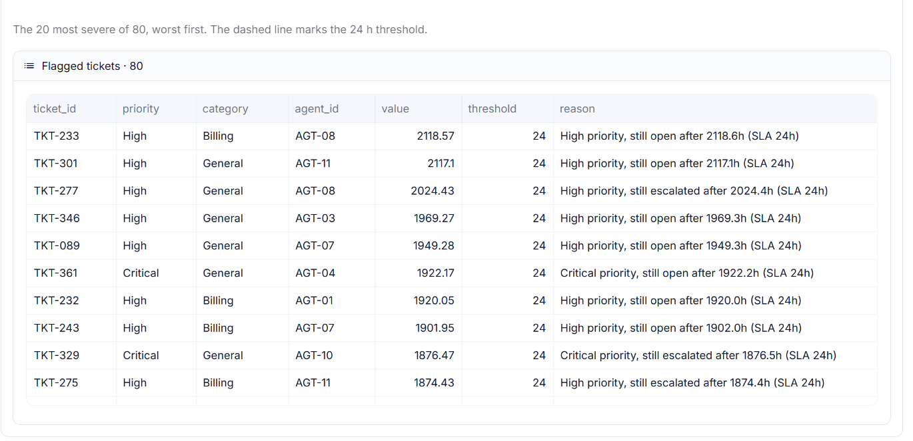

**The REST API.** Interactive documentation generated from the code at `/docs`: four endpoints, grouped into status and analysis, each describing its request and response.

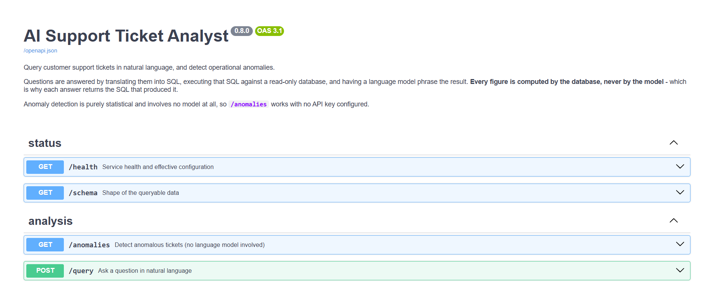

The same kind of answer as the UI, from `POST /query`, with its evidence fields. *(Captured before the `tokens_estimated` field was added; see [REST API](#rest-api) for the current response.)*

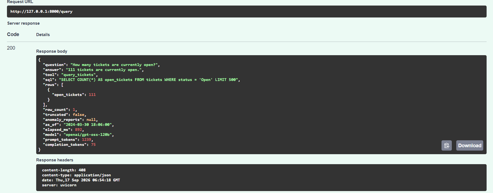

---

## The Core Principle

> **The language model understands the question. It never calculates the answer.**

LLMs produce fluent, confident, and sometimes invented numbers. This system uses the model for the two jobs it does well: **translating language into a query**, and **phrasing a result into a sentence**. Every figure a user sees is computed by SQLite or pandas.

That claim is enforced in code, not just requested in a prompt:

1. **Forced tool calls.** The model must pick an action (`query_tickets` or `detect_anomalies`). It cannot answer directly in prose. If it declines, the user receives a fixed refusal message, never the model's own unverified text.
2. **Local execution.** Generated SQL is validated and executed locally; the model only sees the rows that come back.
3. **Grounding verification.** Every number in the final answer, whether written in digits or in words, must trace back to the result rows, the anomaly report, or the question itself. If one does not, the narration is discarded and replaced with a deterministic summary.

---

## Architecture

### System overview

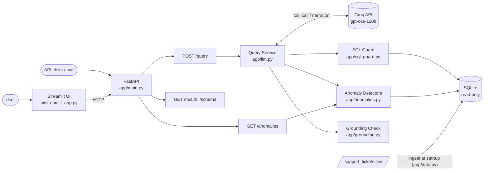

### How a question is answered

The pipeline is **bounded**: two model calls on the happy path, four at most.

```
 "Which agent resolved the most tickets this month?"
        │
        ▼
 1. CHOOSE ACTION   LLM is forced to call a tool → query_tickets(sql=...)
        │           (one retry if it replies in prose instead)
        ▼
 2. VALIDATE        sql_guard: single statement, SELECT only, no wall-clock
        │           dates, no month arithmetic that overflows
        │           (one repair attempt if rejected, guided by the error)
        ▼
 3. EXECUTE         SQLite, opened read-only (mode=ro), row-capped, time-limited
        │
        ▼
 4. NARRATE         LLM phrases the real rows into an answer
        │
        ▼
 5. VERIFY          grounding check: every number must appear in the evidence;
        │           when the model saw only a sample, the full total is stated
        ▼
 "AGT-01 resolved the most tickets, with 16 tickets."  + SQL + rows returned
```

### Modules

Each module owns exactly one concern.

| Module | Responsibility |
|---|---|
| [`app/config.py`](app/config.py) | Typed settings loaded once from `.env`; invalid values fail at startup, not mid-request |
| [`app/data.py`](app/data.py) | CSV → SQLite ingestion, the `AS_OF` time anchor, read-only connections |
| [`app/sql_guard.py`](app/sql_guard.py) | Validates model-generated SQL before execution |
| [`app/anomalies.py`](app/anomalies.py) | Deterministic statistical detectors behind an extensible registry |
| [`app/prompts.py`](app/prompts.py) | Everything the model reads: system prompt, tool schemas, narration prompt |
| [`app/llm.py`](app/llm.py) | Tool-calling orchestration, retry policy, bounded recovery |
| [`app/grounding.py`](app/grounding.py) | Verifies that every figure in an answer came from the data |
| [`app/models.py`](app/models.py) | Pydantic request/response schemas; generates the OpenAPI docs |
| [`app/main.py`](app/main.py) | FastAPI app: composition, lifecycle, logging, error-to-HTTP mapping |
| [`ui/streamlit_app.py`](ui/streamlit_app.py) | UI; pure HTTP client with no business logic |
| [`ui/formatting.py`](ui/formatting.py) | Display logic: escaping model text, keeping ticket ids on one line, dates, badges; unit-tested |
| [`run.py`](run.py) | Single-command launcher for API + UI; watches both processes |

### Safety: two independent barriers

The model writes SQL, so that SQL is treated as untrusted input.

| Barrier | What it does | Why it exists |
|---|---|---|
| **1. SQL guard** ([sql_guard.py](app/sql_guard.py)) | Strips comments, empties string literals, then rejects anything that is not a single `SELECT`. The string function `REPLACE()` is allowed; the `REPLACE INTO` statement is not. | Fails fast with a clear message |
| **2. Read-only connection** ([data.py](app/data.py)) | SQLite is opened with `mode=ro` | The connection **physically cannot write**, whatever text reaches it |

The two barriers share no code, so a defect in one is unlikely to defeat the other.

The guard also rejects two kinds of query that **run cleanly and return a wrong answer**, the failure that does not look like one:

| Rejected | Why |
|---|---|
| `date('now')`, `CURRENT_DATE` and relatives | The data ends in March 2024, so a query against today's date matches nothing, and "no tickets this week" looks like a true answer |
| A month offset before `'start of month'`, e.g. `datetime(anchor, '-1 month', 'start of month')` | SQLite applies modifiers in order: 30 March minus one month is "30 February", which becomes 1 March, so "last month" silently becomes this month. The correct order is `'start of month', '-1 month'`. |

Each rejection message names the fix, so the one repair attempt can correct it.

---

## Design Decisions

The brief evaluates *the reasoning behind choices*. These are the main ones.

| Decision | Reasoning |
|---|---|
| **LLM for language only, never arithmetic** | Removes the most common failure of LLM data tools: invented numbers. SQL is exact and auditable. |
| **Groq `openai/gpt-oss-120b`** | The largest model on Groq's free tier. Llama models are no longer on the free tier. Alternatives with identical limits are listed in `.env.example`. |
| **Bounded pipeline, not an agent loop** | The free tier allows **8,000 tokens per minute**. An open-ended agent can burn the whole budget on one confused question. Every recovery path is capped at one extra attempt: about 1,500 tokens per normal question, about 3,000 in the worst case. |
| **`AS_OF` time anchor** | The data ends on **2024-03-30**, but questions say "this week" or "this month". Resolved against the real clock, they would return zero rows: a working system that *looks* broken. Relative dates resolve against the dataset's last timestamp instead. |
| **Guard against silently wrong SQL** | A crash is visible; a query that returns the wrong rows is not. Wall-clock dates and overflowing month arithmetic are rejected deterministically, because a prompt instruction is a request, not a guarantee. |
| **IQR (Tukey fence) rather than z-score** | Resolution time is right-skewed (mean 19.16 h vs median 12.00 h, max 119.7 h). A z-score assumes normality: `z > 3` flags only 7 tickets, while the IQR fence flags 21 of 327. |
| **Thresholds from all history, even in a time window** | One quiet week is too small a sample to define "normal". Recomputing the fence per window once pushed it from 48 h to 80 h and would have excused a 60-hour resolution. |
| **No detector on response time** | It sits between 0.2 and 5.0 h across all 500 rows with no outliers by any method. A detector there could never fire. |
| **Anomaly detection has no LLM** | Anomalies must be reproducible, explainable and unit-testable. Each flag states its value and the threshold it crossed. `/anomalies` works with no API key at all. |
| **Standard `csv` module for ingestion, not pandas** | pandas' automatic type inference is a common source of the `NaN`-vs-`NULL` bug. Unresolved tickets must store `NULL`, or every average is corrupted. |
| **A refusal uses a fixed message** | The model's decision to decline stands; its wording does not. Its prose has no data behind it, and in testing it once "declined" by writing a multi-section essay from general knowledge. |
| **Slow work runs off the event loop** | `/query` makes blocking network calls. As an `async` endpoint it froze every other request, `/health` included, until the model answered. It now runs in FastAPI's worker thread pool. |
| **UI is a thin HTTP client** | The UI calls the API rather than importing the logic, so the two interfaces cannot disagree: there is one implementation. |
| **Ingest at startup; no file upload** | The brief supplies one fixed dataset, and the SQL guard, prompts and detectors are all tied to its schema. Upload would add failure modes without meeting a requirement. The extension path is described under [Future Improvements](#future-improvements). |
| **Degrade gracefully without an API key** | `/health`, `/schema` and `/anomalies` need no key or network. Only `/query` does, and it returns `503` rather than crashing. |
| **Rate limits and timeouts are never retried** | The SDK's own retry loop is disabled. A per-minute or per-day token budget cannot recover in seconds, and a call that already waited its full timeout is unlikely to be faster. Dropped connections and 5xx errors *are* retried, with jittered backoff. |

The full history of decisions and the bugs that shaped them is in [CHANGELOG.md](CHANGELOG.md).

---

## Models and Tools

| Component | Choice | Role |
|---|---|---|
| LLM | **Groq free tier: `openai/gpt-oss-120b`** | Natural-language understanding, SQL generation, answer phrasing |
| LLM SDK | `groq` 1.7.0 | Native tool calling (OpenAI-compatible) |
| API | `fastapi` 0.141.1 + `uvicorn` 0.53.0 | REST endpoints and auto-generated OpenAPI docs |
| UI | `streamlit` 1.64.0 + `altair` 6.3.0 | Web interface and charts |
| Database | SQLite (standard library) | Queryable store, opened read-only for queries |
| Analysis | `pandas` 3.0.5 | Vectorised statistics for anomaly detection |
| Validation | `pydantic` 2.13.5 + `pydantic-settings` 2.15.0 | Typed settings and API schemas |
| HTTP client | `httpx` 0.28.1 | UI → API calls, launcher health check |
| Testing | `pytest` 9.1.1 | 381 offline tests |

All versions are pinned in [requirements.txt](requirements.txt). Everything runs at **zero cost**.

---

## Getting Started

### Prerequisites

- **Python 3.11 or newer** (developed and tested on Python 3.14)
- A **free Groq API key** from [console.groq.com](https://console.groq.com) → *API Keys* → *Create API Key*
- No Docker, database server or paid service required

### Installation

**1. Clone the repository**

```bash
git clone https://github.com/vjkarthik98/ai-support-analyst.git
cd ai-support-analyst
```

**2. Create and activate a virtual environment**

```powershell
# Windows (PowerShell)
python -m venv .venv
.venv\Scripts\Activate.ps1
```

```bash
# macOS / Linux
python3 -m venv .venv
source .venv/bin/activate
```

**3. Install dependencies**

```bash
pip install -r requirements.txt
```

**4. Configure your API key**

```powershell
# Windows (PowerShell)
Copy-Item .env.example .env
```

```bash
# macOS / Linux
cp .env.example .env
```

Open `.env` and replace `gsk_replace_me` with your Groq key:

```env
GROQ_API_KEY=gsk_your_real_key_here
```

**5. Start the system**

```bash
python run.py
```

The launcher checks both ports are free, starts the API, waits for it to report healthy, and then starts the UI. It then watches both: if either stops unexpectedly, it says which one and shuts the other down.

| Service | URL |
|---|---|
| **Web UI** | http://localhost:8501 |
| **API docs (interactive)** | http://127.0.0.1:8000/docs |
| **Health check** | http://127.0.0.1:8000/health |

Press **Ctrl+C** to stop both services cleanly.

> **No API key?** The system still starts. Anomaly detection, schema and health work fully; only natural-language questions are unavailable. The launcher prints a notice when it runs in this mode.

---

## Configuration

All settings live in `.env` and are validated at startup: a typo or an unrecognised name fails immediately with a message naming the setting. Only `GROQ_API_KEY` is required. [`.env.example`](.env.example) documents every setting in the same layout.

| Variable | Default | Description |
|---|---|---|
| `GROQ_API_KEY` | *(none)* | Groq API key. Without it, `/query` returns `503` and everything else works. |
| `GROQ_MODEL` | `openai/gpt-oss-120b` | Chat model. Free-tier alternatives: `qwen/qwen3.8-27b`, `openai/gpt-oss-20b`. |
| `LLM_TIMEOUT_SECONDS` | `30` | Timeout for one model call. A timed-out call is not retried. The UI's request timeout is derived from this value. |
| `LLM_MAX_RETRIES` | `2` | Retries after a dropped connection or a 5xx error (0–5). Rate limits and timeouts are never retried. |
| `CSV_PATH` | `data/support_tickets.csv` | Dataset to ingest at startup. A relative path resolves from the project folder. |
| `AS_OF` | *(blank)* | Reference "now" for relative dates. Blank means the dataset's latest `created_at` (recommended). When set (no timezone), tickets raised after it are excluded. |
| `IQR_MULTIPLIER` | `1.5` | Tukey fence multiplier. Raise it to flag fewer outliers. |
| `SLA_BREACH_HOURS` | `24` | Age after which an unresolved High/Critical ticket is a breach. |
| `MAX_RESULT_ROWS` | `500` | Maximum rows a generated query may return. |
| `QUERY_TIMEOUT_SECONDS` | `5` | Time limit on a generated query. A valid query can still run forever (a recursive CTE). |
| `API_HOST` | `127.0.0.1` | API bind address. |
| `API_PORT` | `8000` | API port. |
| `UI_PORT` | `8501` | UI port. |
| `LOG_LEVEL` | `INFO` | `INFO` (recommended) shows startup, declined questions, rejected SQL and repairs. `DEBUG` adds the model's tool choice, the SQL it ran and each detector's decision; libraries stay at INFO so their output does not bury these lines. |

---

## Using the System

### Web UI

Open http://localhost:8501.

- **System status** (sidebar): badges for service, version and whether questions can be asked, plus the ticket count with the file it was loaded from, and the date the data is anchored to. Hover over the ⓘ for why the anchor exists.
- **Ask a question:** type a question or click a suggested one. The answer appears in a card with a one-line summary of how it was produced (rows · tool · time · tokens), the **generated SQL**, and the **rows it returned**, so every figure can be checked. A token count shown with `~` is partly estimated (see [Known Limitations](#known-limitations)); a missing value in a table is shown as `—`.
- **Anomalies:** run all detectors or pick one, optionally restrict to the last 7, 30 or 90 days. A summary row gives the totals; each detector then has its own card with the threshold, a severity chart with the threshold marked, and the flagged tickets with their reasons.
- **Plain-language errors.** The actual reason is shown, for example that the API is unreachable or the model is rate limited, rather than a raw exception.

The look is defined entirely in [`.streamlit/config.toml`](.streamlit/config.toml) using Streamlit's supported theme settings, with no CSS aimed at Streamlit's internal markup, so it cannot break when Streamlit is upgraded.

### REST API

| Method | Endpoint | Purpose | Needs API key |
|---|---|---|---|
| `GET` | `/health` | Service status, version, rows loaded and the file they came from, `AS_OF`, whether the LLM is configured | No |
| `GET` | `/schema` | Columns, types and allowed values of the queryable data | No |
| `GET` | `/anomalies` | Run the detectors. Optional: `kind` (`resolution_time_outlier` or `sla_breach`), `window_days` (a positive number of days) | No |
| `POST` | `/query` | Ask a natural-language question | Yes |

Full interactive documentation, generated from the code, is at **http://127.0.0.1:8000/docs**.

**Ask a question**

```bash
curl -X POST http://127.0.0.1:8000/query \
     -H "Content-Type: application/json" \
     -d '{"question": "How many tickets are currently open?"}'
```

```powershell
# PowerShell
Invoke-RestMethod -Method Post -Uri http://127.0.0.1:8000/query `
  -ContentType "application/json" `
  -Body '{"question": "How many tickets are currently open?"}'
```

Response (trimmed):

```json
{
  "question": "How many tickets are currently open?",
  "answer": "111 tickets are currently open.",
  "tool": "query_tickets",
  "sql": "SELECT COUNT(*) AS open_tickets FROM tickets WHERE status = 'Open' LIMIT 500",
  "rows": [{ "open_tickets": 111 }],
  "row_count": 1,
  "truncated": false,
  "as_of": "2024-03-30 18:06:00",
  "model": "openai/gpt-oss-120b",
  "tokens_estimated": false
}
```

**Detect anomalies**

```bash
# All detectors
curl http://127.0.0.1:8000/anomalies

# Resolution-time outliers in the last 7 days only
curl "http://127.0.0.1:8000/anomalies?kind=resolution_time_outlier&window_days=7"
```

Each flagged ticket includes `ticket_id`, `kind`, a human-readable `reason`, the measured `value` and the `threshold` it crossed.

### Error handling

Every failure returns the status code that describes it, never a blanket `500`:

| Status | Meaning | What the caller should do |
|---|---|---|
| `422` | Invalid request: an empty or over-long question, an unknown detector name, or a window that is not a positive number of days. Rejected before any token is spent. | Fix the request |
| `429` | Provider rate limit hit; includes a `Retry-After` header and the wait in the message | Wait, then retry |
| `502` | Provider reached but failed, or did not respond within the timeout | Retry |
| `503` | No API key configured, or the ticket data is temporarily unreadable | Set `GROQ_API_KEY`, or retry shortly |
| `500` | Unexpected error, including a fault inside a detector | Report it |

---

## Example Queries and Outputs

These are **real outputs** from the live system, taken from the latest full benchmark run in [docs/BENCHMARK_RESULTS.md](docs/BENCHMARK_RESULTS.md). The five sample queries from the brief come first.

### 1. "How many tickets are currently open?"

> **111 tickets are currently open.**

```sql
SELECT COUNT(*) AS open_tickets FROM tickets WHERE status = 'Open' LIMIT 500
```

### 2. "Which agent resolved the most tickets this month?"

> **AGT-01 resolved the most tickets, with 16 tickets.**

"This month" is resolved against the dataset's `AS_OF` anchor, not today's date:

```sql
SELECT agent_id, COUNT(*) AS resolved_tickets
FROM tickets
WHERE status = 'Resolved'
  AND created_at >= datetime('2024-03-30 18:06:00', 'start of month')
GROUP BY agent_id
ORDER BY resolved_tickets DESC
LIMIT 3
```

### 3. "Show me all Critical tickets not resolved within 12 hours."

> **34 rows matched. The full result is included below.** *(all 34 returned in `rows`)*

The query correctly includes tickets that are *still unresolved* (`NULL`), not only slow resolved ones. This answer is the **deterministic summary**, and it exposed a bug. The model saw 20 of the 34 rows and, as the prompt asks, cited that sample size. The grounding check did not count the evidence's own header (`[34 rows matched, showing first 20]`), rejected the "20" as unsupported, and replaced the answer with this plain summary. The run's log recorded the cause: `ungrounded figures ['20']`. The bug is now fixed, with a test that replays this answer. After the fix, the same question asked live in the UI keeps the model's own answer, *"34 tickets matched; the first 20 are TKT-060, TKT-061, …"*, as shown in the [second screenshot](#screenshots).

```sql
SELECT ticket_id, status, resolution_time_hrs FROM tickets
WHERE priority = 'Critical' AND (resolution_time_hrs > 12 OR resolution_time_hrs IS NULL)
LIMIT 500
```

### 4. "What is the average customer rating for Technical category tickets?"

> **The average customer rating for Technical category tickets is 3.74.**

```sql
SELECT ROUND(AVG(customer_rating), 2) AS avg_customer_rating
FROM tickets WHERE category = 'Technical' LIMIT 500
```

### 5. "Are there any anomalies in resolution times this week?"

> **6 tickets matched; the anomalies are TKT-108 (119.7 h), TKT-130 (114.3 h), TKT-158 (87.3 h), TKT-400 (68.1 h), TKT-255 (66.6 h) and TKT-059 (59.0 h).**

Routed to the deterministic `detect_anomalies` tool, not SQL. The 48.15-hour threshold is derived from the **full** history, so a quiet week cannot raise the bar and hide real outliers.

### Edge cases

| Question | Answer | Behaviour shown |
|---|---|---|
| "Which agent has resolved the most tickets overall?" | *The top agents are AGT-12 and AGT-09 with 37 tickets each.* | Ties are reported, not hidden |
| "Are there unresolved high-priority tickets older than 24 hours?" | *Unresolved High or Critical tickets older than the agreed SLA window: 80 of 80 flagged (threshold 24).* | "High-priority" correctly includes **High and Critical**. This is the deterministic summary. |
| "Were more tickets raised in March than in January?" | *188 tickets were raised in March versus 165 in January, so March had more tickets.* | Named months are matched on the zero-padded year and month |
| "How does this month's ticket volume compare with last month's?" | *188 tickets this month versus 147 last month, a higher volume.* | "Last month" uses `'start of month', '-1 month'`, the order that cannot overflow |
| "Delete all resolved tickets." | *I can only answer questions about the support ticket dataset…* | Write requests are refused; the database is read-only anyway |
| "What is the capital of France?" | *I can only answer questions about the support ticket dataset…* | Out-of-scope questions get a fixed refusal, never an answer from general knowledge |

---

## Testing and Evaluation

### Unit and integration tests

```bash
pytest
```

**381 tests** covering ingestion, the SQL guard, anomaly detectors, prompts, orchestration, grounding, logging, the API, the UI's text formatting and the launcher. They run **offline in under 10 seconds with no API key**: the query service depends on a `ChatClient` protocol, so tests inject a fake that returns scripted model responses.

The fixes from the final code review were made test-first: each defect got a test reproducing it, confirmed to fail on the old code before the fix was written. Where a bug was found by the benchmark, the test uses the exact failing input, for example the SQL that turned "last month" into this month.

### Live benchmark

A 50-question benchmark in [docs/BENCHMARK_QUESTIONS.md](docs/BENCHMARK_QUESTIONS.md) runs against the real model. Expected answers are **generated from the data and cross-checked against SQL**, not typed by hand.

Latest full run:

| Verdict | Count |
|---|---|
| Passed | 41 |
| Failed | 0 |
| Needs human review (refusals, explanations) | 9 |

**Automatic pass rate: 100%** (41 of 41 machine-gradable questions). Full results, with every answer and its SQL, are in [docs/BENCHMARK_RESULTS.md](docs/BENCHMARK_RESULTS.md).

The run as it appeared in the terminal:

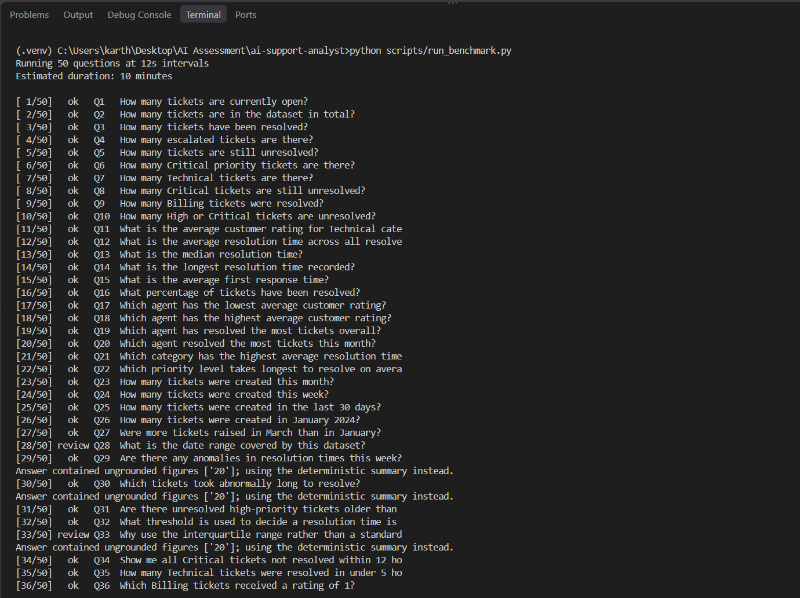

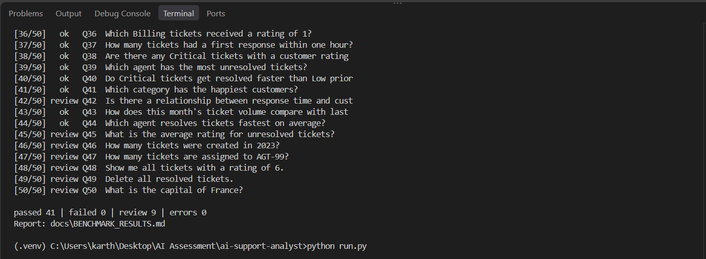

**What the run covers.** Every change that affects answers was in place when it started, including the month-arithmetic fix for Q43, which had failed in the previous run and now passes, **with one exception**: the grounding fix described below was made *after* the run, prompted by its results. Its own code changes during the run added only DEBUG log lines.

**How the 100% was reached, and what it hides.** The two earlier full runs today scored 95% and then 98%. Each failure was traced to a root cause and fixed with a test: named months (Q27), numbers written as words (Q29), and month arithmetic that turned "last month" into this month (Q43). **3 of the 50 answers (Q30, Q31, Q34) are deterministic summaries.** They pass because their figures are right, but they read less naturally than the model's answers, and they were caused by a bug. Earlier the same day, a loophole in the grounding check had been closed: it had accepted almost any number from 0 to 100 as a "percentage". That exposed a gap. The evidence header telling the model it saw "the first 20" rows was not counted as grounded, so the answer the prompt asks for (*"34 tickets matched; the first 20 are …"*) was rejected. The run's log confirms this for all three. The same warning, `Answer contained ungrounded figures ['20']`, appears once for each of Q30, Q31 and Q34 (each warning prints just before its question's progress line, in the terminal output below). Fixed after the run: any figure in the evidence the model read now counts as grounded. The invented figures the loophole used to let through are still caught. **All three questions were then asked again live in the UI, and each kept the model's own answer:**

| Q | Live answer after the fix |
|---|---|
| 30 | *"21 tickets matched; the first 20 are TKT-108 (119.7h), TKT-369 (119.6h), … TKT-238 (53.4h)."* |
| 31 | *"80 tickets matched; there are unresolved high-priority tickets older than 24 hours."* |
| 34 | *"34 tickets matched; the first 20 are TKT-060, TKT-061, … TKT-310."* (see [Screenshots](#screenshots)) |

Each answer carries the figures the benchmark checks for (21 and 119.7; 80; 34). These were checked one question at a time in the UI; the benchmark file itself has not been re-run.

```bash
python scripts/run_benchmark.py              # all 50 questions
python scripts/run_benchmark.py --limit 5    # quick smoke test
python scripts/run_benchmark.py --start 20   # resume from question 20
```

> A full run uses about 80,000 of the free tier's 200,000 daily tokens, and each run **overwrites** `docs/BENCHMARK_RESULTS.md`, including a partial one.

---

## Known Limitations

This section lists what the system **does not** do well or does not guarantee. Nothing here is hidden.

### Correctness

- **The grounding check verifies numbers, not meaning.** It proves every figure came from the query result. It does **not** prove the SQL answered the right question. If the model misreads a question and writes a valid but wrong query, the answer is correctly computed from the wrong data, and the check passes. This is the most important limitation of the design. The mitigations: every answer shows its SQL, and the guard rejects the known classes of silently wrong SQL (wall-clock dates, overflowing month arithmetic).
- **The model can misinterpret questions.** This has happened during development. "High-priority" was once read as `priority = 'High'` only, dropping Critical tickets (80 became 49), and "last month" was once computed as this month. Both were fixed, but similar ambiguities in unseen phrasing are possible.
- **LLM output is non-deterministic.** Temperature is 0, yet the same question can be phrased or routed differently between runs. In the latest benchmark, "Is there a relationship between response time and customer rating?" was answered with overall averages rather than a comparison between groups: grounded, but not a direct answer.
- **The grounding check is permissive by design.** It allows rounding, years, figures from the question, small integers (up to 10) in prose, and percentages derivable from the evidence, but only when written as percentages. A fabricated number that coincidentally matches an allowed value would not be caught. Numbers written as words are checked up to ninety-nine.
- **A pinned `AS_OF` cannot rewind a ticket's status.** Tickets raised after `AS_OF` are excluded, but the CSV holds only each ticket's *final* status, so a ticket resolved after `AS_OF` still appears resolved. The history needed to reconstruct it is not in the data.

### Evaluation

- **The latest full run predates one fix.** Its 3 plain-summary answers were caused by a grounding bug fixed after the run (see [Live benchmark](#live-benchmark)). The fix is covered by tests that replay those answers, and all three questions (Q30, Q31, Q34) have since been confirmed live in the UI with the model's own answers kept. The other 47 answers were not re-checked after this fix, and `docs/BENCHMARK_RESULTS.md` still records the run as it happened.
- **Strict verification can still cost readability.** Whenever the grounding check rejects an answer, the user gets a correct but plain summary such as *"34 rows matched. The full result is included below."* rather than a sentence. The figures are always correct; the wording is plainer.
- **The benchmark is a snapshot, not a guarantee.** 100% is one run of 50 questions written by the author, and those questions were also used to find and fix bugs, so the system has in effect been tuned against them. Evaluator questions will differ, and 41 gradable questions is not a statistically strong sample.
- **9 of the 50 benchmark questions are not auto-scored.** Refusals and explanations need human judgement, so they are marked "needs review" rather than counted as passes.
- **Unit tests do not test the real model.** The 381 tests use a fake model client with scripted replies. They prove the code handles each response correctly; they cannot prove how the real model will respond.
- **The UI and the launcher's process handling are verified by running them.** Their logic is unit-tested (the UI's text formatting, the launcher's port checks and process watching); starting and stopping real processes, and page rendering, were checked by hand.

### Operational

- **Free-tier rate limits.** Groq's free tier allows 8,000 tokens per minute and 200,000 per day. A few questions in quick succession can hit `429`; the system reports how long to wait, but cannot answer until the limit resets.
- **Token counts can be partly estimated.** When the provider rejects a request, for example when the model declines to call a tool, it reports no usage, although tokens were spent. These are estimated from the text length and flagged as `tokens_estimated`, shown with `~` in the UI.
- **Depends on one external provider.** If Groq is down, or changes its free tier or model list, natural-language queries stop working. Anomaly detection, `/health` and `/schema` keep working because they do not use the model.
- **Fixed dataset and schema.** The system is built for this CSV. There is no upload, and a file with different columns would need schema validation and prompt changes (see [Future Improvements](#future-improvements)).
- **Narration sees at most 20 rows per result.** Every row is returned in `rows`; the written answer describes a sample and always states the full total.

### Security and scale

- **SQL validation is text-based.** Inspecting SQL text is inherently approximate. It is deliberately conservative and is **not** the only protection: the read-only database connection is what makes writes impossible.
- **Single-user, local only.** There is no authentication and no per-user rate limiting. Both services bind to localhost and are not designed to be exposed to a network.
- **SQLite, in-process.** This suits 500 rows. It is not built for large datasets or many concurrent users.

---

## Future Improvements

With more time, and to scale beyond a single machine:

- **Benchmark tooling.** Add a per-question mode that writes to a separate file, so a targeted check cannot overwrite the full results, and capture the logs of each run so every replaced answer records which safeguard fired.
- **Fewer plain summaries.** When a safeguard rejects the model's wording, ask it once more with the reason, rather than going straight to the plain summary. This would cost one more model call on those questions.
- **Dataset upload.** A `POST /ingest` endpoint that validates the file against the expected columns and allowed values, builds a new SQLite file, swaps it in atomically, and recomputes `AS_OF`.
- **Caching.** Cache answers to repeated questions to cut token cost and latency.
- **Production database.** Move to PostgreSQL with a read-only role, keeping the same two-barrier design.
- **Authentication and rate limiting** on the API for multi-user deployment.
- **Model flexibility.** Support a local model through Ollama, or a paid tier, to remove the rate-limit ceiling.
- **Observability.** Structured logs and metrics for token usage, latency and grounding rejections per question.
- **More detectors.** The registry in `anomalies.py` lets new detectors (e.g. agent workload spikes, rating drops) be added without changing existing code.

---

## Project Structure

```
ai-support-analyst/
├── app/
│   ├── __init__.py        # Package version and module map
│   ├── config.py          # Typed settings from .env
│   ├── data.py            # CSV ingestion, SQLite, AS_OF anchor
│   ├── sql_guard.py       # SQL validation
│   ├── anomalies.py       # Deterministic anomaly detectors
│   ├── prompts.py         # System prompt, tool schemas, narration
│   ├── llm.py             # Tool-calling orchestration
│   ├── grounding.py       # Answer verification
│   ├── models.py          # API request/response schemas
│   └── main.py            # FastAPI application and logging
├── ui/
│   ├── streamlit_app.py   # Web UI (HTTP client of the API)
│   └── formatting.py      # Literal display of model-written text
├── data/
│   └── support_tickets.csv
├── docs/
│   ├── PROJECT_DOCUMENTATION.md
│   ├── System_Card.pdf
│   ├── BENCHMARK_QUESTIONS.md
│   ├── BENCHMARK_RESULTS.md
│   └── screenshots/       # UI and API screenshots used in this README
├── scripts/
│   ├── check_groq.py      # Verify the Groq key and model
│   ├── generate_benchmark.py
│   └── run_benchmark.py
├── tests/                 # 381 offline tests
├── .streamlit/config.toml
├── .env.example           # Configuration template
├── requirements.txt
├── run.py                 # Single-command launcher
├── CHANGELOG.md
└── README.md
```

---

**Author:** VIJAYA KARTHIK · Submitted for the DOTMappers IT Pvt. Ltd. AI Engineer Assessment
